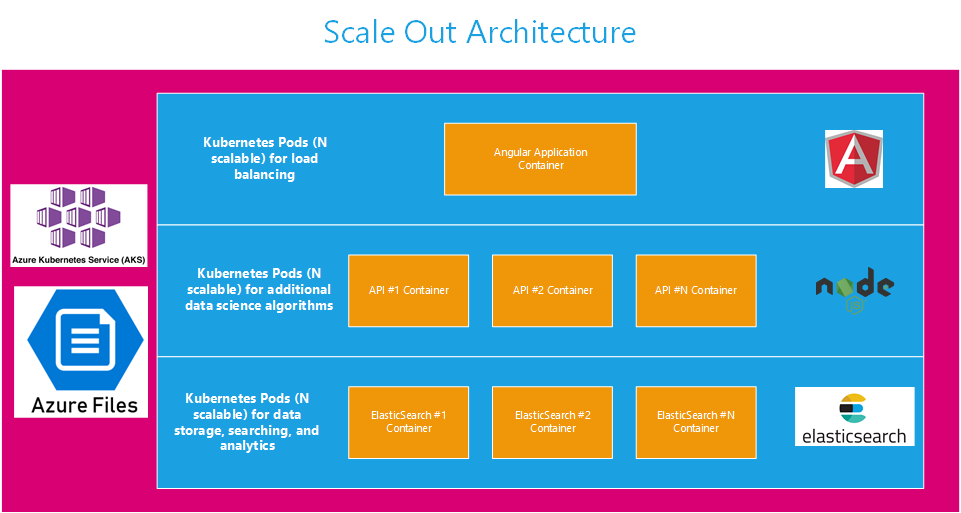

# Smoky Mountains Data Challenge - Sponsored by ORNL

C2 Labs participated in this data challenge to demonstrate our growing capabilities in big data and data science.  Information about the challenge can be found on the [Smoky Mountain Data Challenge website](https://smc-datachallenge.ornl.gov/).

We chose to participate in [Challenge 6 - Using Artificial Intelligence Techniques to Match Patients with their Best Clinical Trial Options](https://smc-datachallenge.ornl.gov/challenges-2020/challenge-6-2020/).

## About this Repository

There were multiple components of this project that were assembled to deliver the final solution:

- **ElasticSearch** - configured an ELK stack to provide a big data platform for effeciently searching through large amounts of data leveraging [Azure Kubernetes Service](https://azure.microsoft.com/en-us/services/kubernetes-service/).
- **Datasets** - scripts for processing data sets and flat files created from data engineering work
- **Python** - contains analytical techniques using Python to build a data science model for matching patients to trials
- **R** - contains analytical techniques using R to build a data science model for matching patients to trials
- **Data Wookies** - contains source code for the Angular application that provides a front-end for interacting with the data models and APIs for processing data and connecting to ElasticSearch

## Solution Architecture

## Scale-Out Architecture

## Run the Application Locally

- Install NodeJS, Angular, and Python3 on your local development machine 
- Install all dependencies with `npm install` and `pip install`
- From the data-wookies folder, run `npm run dev` to start the Node.js web server for Express (hosts the APIs)
- From the data-wookies\client folder, run `ng serve` to start the Angular web server (front-end application)

## Pre-Requisites

- Download and install Python (recommend version 3) - [Download](https://www.python.org/downloads/)
- Download and install NodeJS (recommend 12.18.3 Long Term Support) - [Download](https://nodejs.org/en/download/)
- Download and install Angular CLI (must be >= 9.0 version) - [Download](https://cli.angular.io/)
- Install the application packages for Python using pip, `python3 -m pip install packageName`

## Development server
Open a terminal and from the datawookies folder run `npm run dev` to startup the NodeJS dev server.

Open a second terminal and from the client folder run `ng serve` to startup the Angular dev server. Open the [website locally](http://localhost:4200/)

The app will automatically reload if you change any of the Angualr source files.  Restart the NodeJS server if you change any Python or Express.js code.

## Code scaffolding

Run `ng generate component component-name` to generate a new component. You can also use `ng generate directive|pipe|service|class|guard|interface|enum|module`.

## Build

Run `ng build` to build the project. The build artifacts will be stored in the `dist/` directory. Use the `--prod` flag for a production build.

## Running unit tests

Run `ng test` to execute the unit tests via [Karma](https://karma-runner.github.io).

## Running end-to-end tests

Run `ng e2e` to execute the end-to-end tests via [Protractor](http://www.protractortest.org/).

## Further help

To get more help on the Angular CLI use `ng help` or go check out the [Angular CLI README](https://github.com/angular/angular-cli/blob/master/README.md).