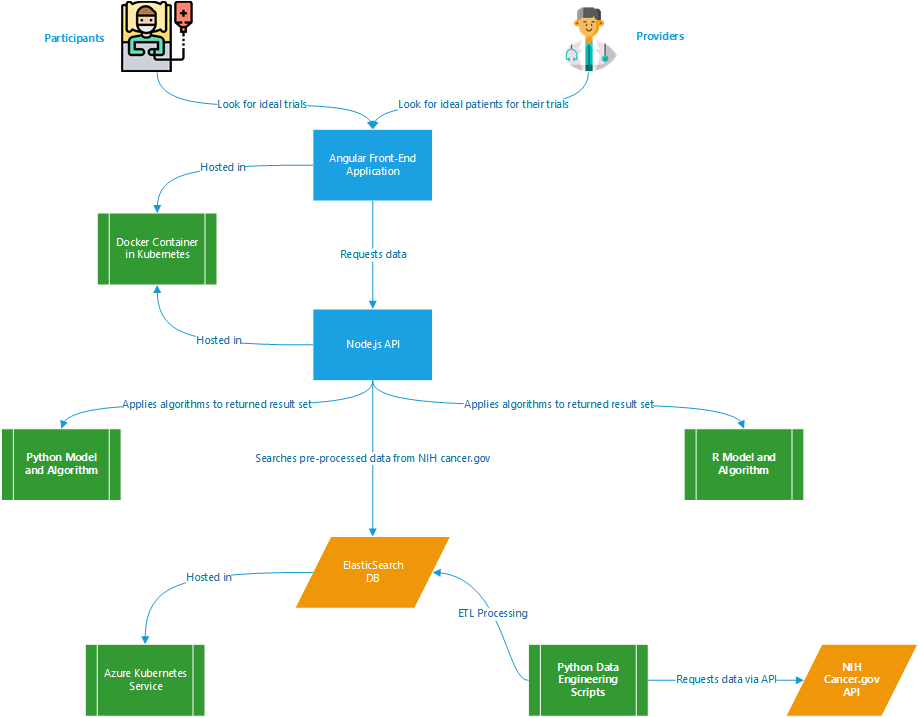

# Smoky Mountains Data Challenge - Sponsored by ORNL

C2 Labs participated in this data challenge to demonstrate our growing capabilities in big data and data science.  Information about the challenge can be found on the [Smoky Mountain Data Challenge website](https://smc-datachallenge.ornl.gov/).

We chose to participate in [Challenge 6 - Using Artificial Intelligence Techniques to Match Patients with their Best Clinical Trial Options](https://smc-datachallenge.ornl.gov/challenges-2020/challenge-6-2020/).

## About this Repository

There were multiple components of this project that were assembled to deliver the final solution:

- **ElasticSearch** - configured an ELK stack to provide a big data platform for effeciently searching through large amounts of data leveraging [Azure Kubernetes Service](https://azure.microsoft.com/en-us/services/kubernetes-service/).
- **Datasets** - scripts for processing data sets and flat files created from data engineering work
- **Python** - contains analytical techniques using Python to build a data science model for matching patients to trials
- **R** - contains analytical techniques using R to build a data science model for matching patients to trials
- **Data Wookies** - contains source code for the Angular application that provides a front-end for interacting with the data models and APIs for processing data and connecting to ElasticSearch

## Solution Architecture

## Run the Application Locally

- Install NodeJS, Angular, and Python3 on your local development machine 
- From the data-wookies folder, run `npm run dev` to start the Node.js web server for Express (hosts the APIs)
- From the data-wookies\client folder, run `ng serve` to start the Angular web server (front-end application)